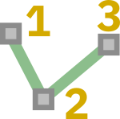
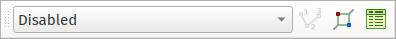
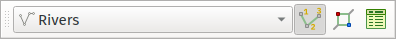
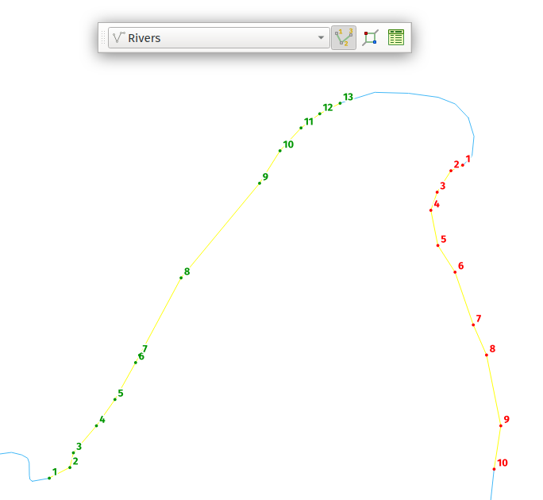
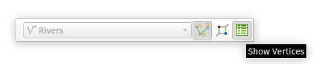
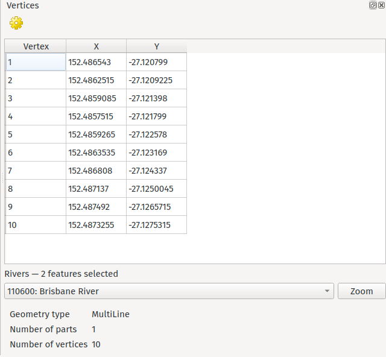
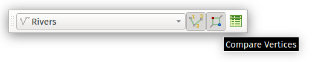
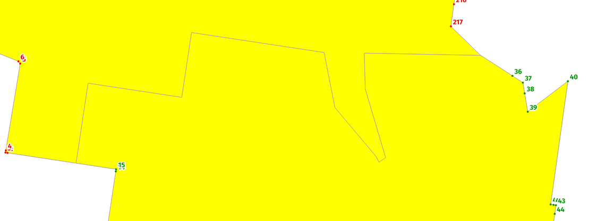
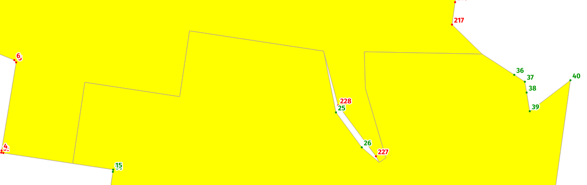

# QGIS Vertex Compare Plugin - Documentation

## Introduction

The Vertex Compare plugin allows users to quickly visualise the placement and relationship of vertices
within features. It also provides a way of easily viewing topological discrepancies between features,
aiding data cleansing and maintenance.

*The plugin requires QGIS 3.20 or later.*

The plugin is created by [North Road Consulting](http://north-road.com) on behalf of Natural Resources Canada.

## Plugin Workflow

All plugin actions are controlled through the Vertex Compare Toolbar, which will be shown as soon as the
plugin is installed:

Before the plugin can be used, it is necessary to select a target layer from the drop down
list on the left of the toolbar. All plugin actions will apply for the layer selected in this list
**only**:

If the *Disabled* option is selected then all plugin functionality will be temporarily disabled.

## Showing Vertex Numbers

Clicking the "Show Vertex Numbers" option in the toolbar will turn on vertex numbering for all
features currently selected in the target layer:

The numbering will follow the layer selection, so selecting new features will change the numbered
features to the new selection. Each individual feature in the selection will be numbered using
a different color to allow distinction between vertices from different features.

## Vertex Table

Clicking the "Show Vertices" option in the toolbar will open a new dock window showing a summary of
vertices from the selected features:

The vertex table opens as a new dockable window:

From top to bottom this dock offers the functionality:

- A toolbar, with a shortcut to the plugin settings
- A table containing vertex number (matching the numbers on the map) and the corresponding x and y
coordinate values. If the features contain Z or M values these will also be shown in the table. Double-clicking
  any entry in this list will cause the map view to recenter on the selected vertex.
- A drop down list allowing control of which selected feature should be shown in the vertex table.
Clicking the "Zoom" button next to this list will cause the map view to recenter on the chosen feature.
- A summary of the geometry of the chosen feature, including the geometry type, number of parts, and
total number of vertices.
  
## Compare Vertices

The "Compare Vertices" toolbar action allows the vertices from two selected features to be visually compared:

When this option is active then vertex numbering for **exactly** coincident vertices will be hidden:

If vertices are offset from each other than the numbering will show, allowing for easy identification
of topologically invalid neighbouring features:

## Plugin Options

The plugin options are available from the Options button in the dock window. Options are available for:

- Control over which vertices should be labeled
- The point symbol to use for labeled vertices
- The font and text style to use for vertex numbers
- The numerical format for the vertex table, including number of decimal places to show
- Options for tweaking the behaviour of the vertex table, such as suppressing the highlighting effect
for vertices.
  

